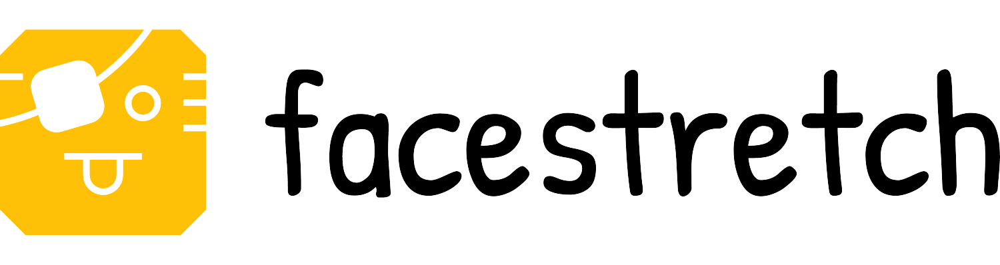

# facestretch




## Table of Contents

* [About the Project](#about-the-project)
  * [Built With](#built-with)
* [Getting Started](#getting-started)
  * [Prerequisites](#prerequisites)
  * [Installation](#installation)
* [Usage](#usage)
  * [App Usage](#app-usage)
  * [Training Usage](#training-usage)
* [Authors](#authors)
* [Acknowledgments](#acknowledgments)


## About The Project

In ```facestretch``` we describe how we exploited the dlib’s facial landmarks in order to measure face deformationand perform an expression recognition task.  We implemented multiple approaches, mainly based on supervised and weakly-supervised metric learning, neural networks and geodesic distances on a Riemannian manifold computed a transformation of the detected landmarks. For training the metric-learning and neural networks models we built a small dataset made of eight facial expression for each subject.

For more information read the [paper](https://gitlab.com/reddeadrecovery/facestretch/-/blob/master/docs/facestretch.pdf) located in the docs directory.

### Built With

* [Python](https://www.python.org/)
* [OpenCV](https://opencv.org/)
* [Metric Learn](http://contrib.scikit-learn.org/metric-learn/introduction.html)
* [Tensorflow](https://www.tensorflow.org/)
* [Keras](https://keras.io/)


## Getting Started

To get a local copy up and running follow these simple steps.

### Prerequisites

The project provide a ```Pipfile``` file that can be managed with [pipenv](https://github.com/pypa/pipenv).
```pipenv``` installation is **strongly encouraged** in order to avoid dependency/reproducibility problems.

* pipenv
```sh
pip3 install pipenv
```

### Installation
 
1. Clone the repo
```sh
git clone https://gitlab.com/reddeadrecovery/facestretch
```
2. Install Python dependencies
```sh
pipenv install
```

## Usage

### App Usage
The repo already contains the trained models described in the [paper](https://gitlab.com/reddeadrecovery/facestretch/-/blob/master/docs/facestretch.pdf).
For running such trained models just run the app executing the file ```detect_landmarks.py```

You can control the app through the keyboard:
* Press **s** to save the neutral facial expression
* Press **a** or **d** to switch the reference facial expression
* Press **w** or **x** to switch models
* Press **c** to display the landmarks
* Press **n** to display the (out of scale) normalized landmakrs
* Press **q** to exit from the app


### Training Usage
For training from scratch new models with a new dataset follow these steps:

* Delete ```.gitkeep``` file from ```dataset_metric_learning```, ```dataset_neural_training``` and ```dataset_neural_validation```
* Copy the dataset into the folder ```dataset_metric_learning``` in format ***subject_action.ext***. Remember to assign the format ***subject_neutro.ext*** to the neuter images
* Split the dataset into training and validation, after that copy the split sets in ```dataset_neural_training``` and ```dataset_neural_validation``` always in format ***subject_action.ext***
* Run ```reference_landmark.py```
* Run ```train.py``` selecting the model to train
* Run ```neural_network.py``` copying at the end the best model in the folder ```models```

Once trained the new models you can run ```detect_landmarks.py```

Every file with extension ***.py*** is executable. If you have ```pipenv``` installed, executing them
so that the python interpreter can find the project dependencies is as easy as running ```pipenv run python $file```.

Here's a brief description of each and every executable file:

* ```detect_landmarks.py```: Run the application which detects facial expressions
* ```dataset.py```: Dataset building
* ```neural_networks.py```: Neural Network training
* ```reference_landmarks.py```: Facial expression reference landmarks calculation
* ```train.py```: Metric Learning trainig
* ```utils.py```: Utils file

## Authors

* [**Alberto Baldrati**](https://github.com/ABaldrati)
* [**Giovanni Berti**](https://github.com/giovanniberti)


## Acknowledgments
Image and Video Analyis © Course held by Professor [Pietro Pala](https://scholar.google.it/citations?user=l9j1pZEAAAAJ&hl=en) - Computer Engineering Master Degree @[University of Florence](https://www.unifi.it/changelang-eng.html)
